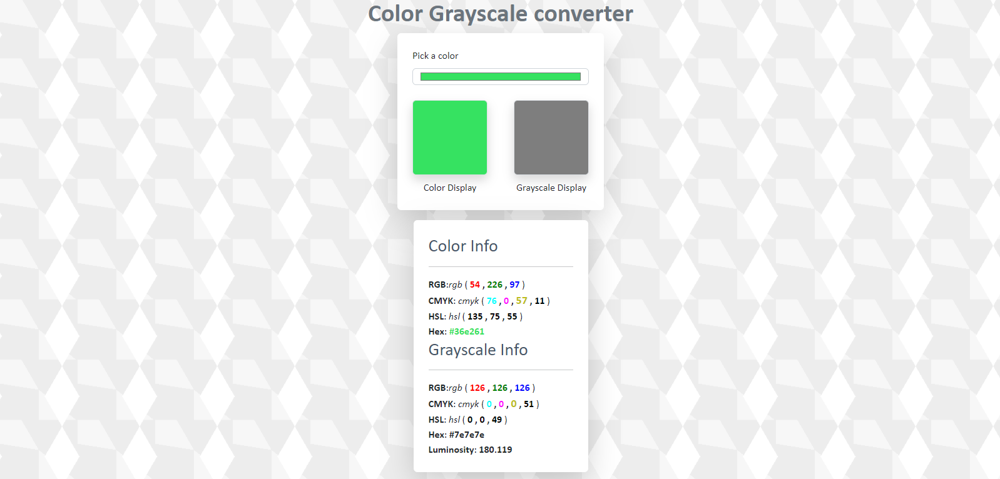

# Color Grayscale converter

A grayscale color converter is a web tool that allows users to convert color values to their grayscale equivalents, typically using HTML for structure, CSS for styling, Bootstrap for responsive design, and JavaScript for the conversion logic.

> The demo can be viewed [here](https://github.com/bilal4821/Grayscale-Converter)

## Technologies Used
- HTML
- CSS
- Bootstrap
- Javascript

## Features

-  Instantly converts color values to grayscale as users input or modify color codes.
-  Utilizes HTML and Bootstrap for a user-friendly interface with responsive design elements.
-  Allows users to enter color codes in various formats (e.g., hex, RGB) and view their grayscale counterparts.

## Preview 
